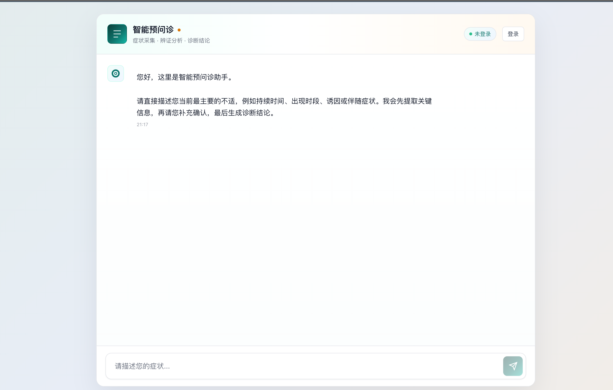
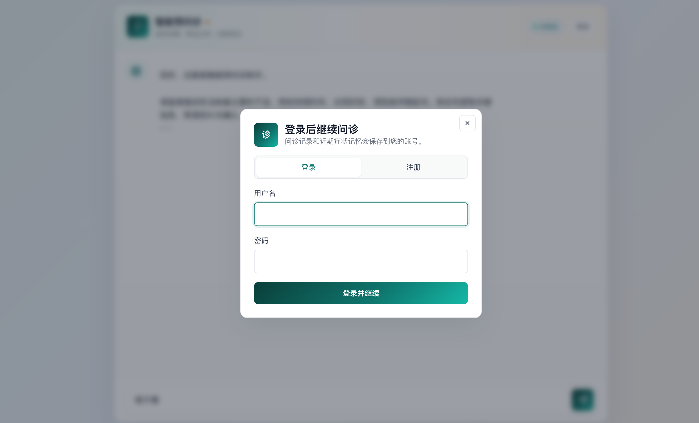
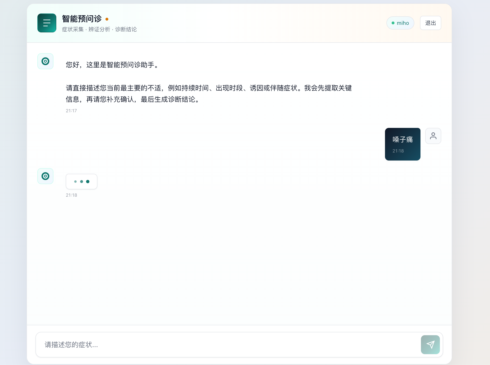
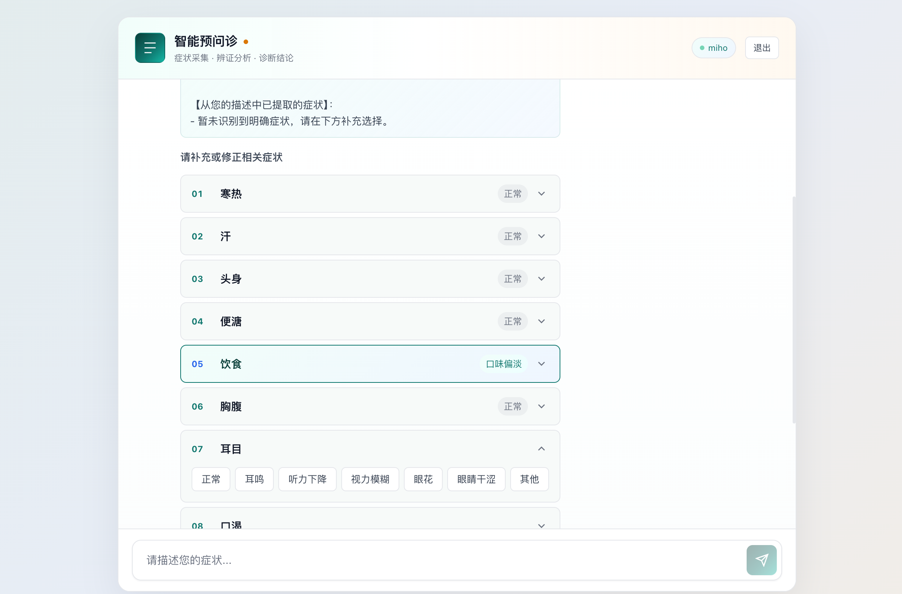
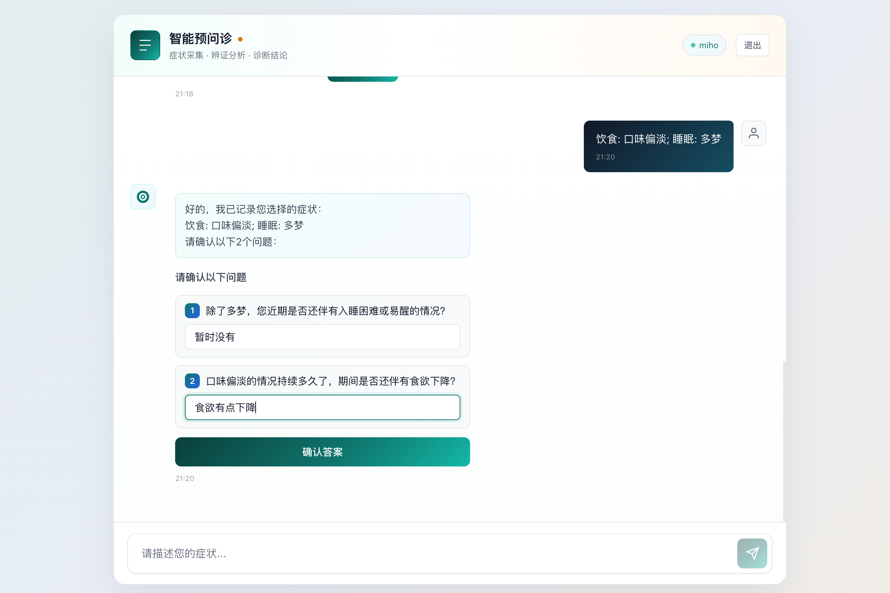
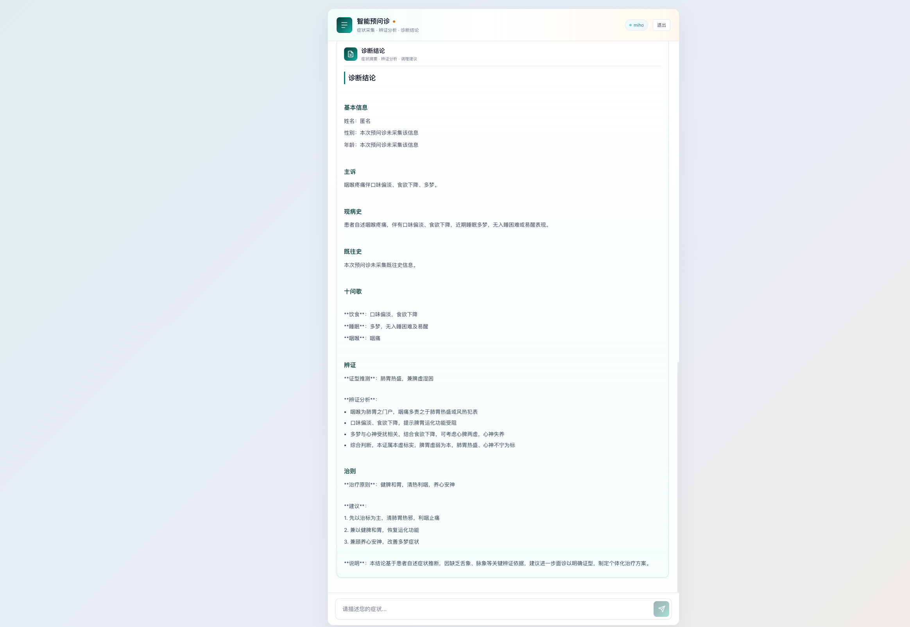

# predoc_ai 智能预问诊平台

`predoc_ai` 是一个面向中医预问诊场景的 AI 辅助系统，用于在正式诊疗前完成症状采集、意图识别、关键信息确认、知识库检索和诊断结论草拟。系统包含前端聊天界面、后端 FastAPI 服务、用户注册登录、本地短期记忆和 RAG 知识库检索能力。

> 说明：本项目生成内容用于预问诊信息整理和辅助参考，不能替代医生面诊、检查和处方决策。

## 核心功能

- 用户注册和登录：未登录时可浏览首页，开始问诊时弹出登录/注册窗口。
- 短期记忆：登录用户的近期问诊内容会保存到账号中，新会话可作为上下文参考。
- 意图识别：首轮及后续关键表达会识别用户意图，例如初诊、复诊、快速咨询、单症状咨询、处方诉求等。
- 症状采集：支持用户自然语言描述症状，并通过十问维度补充信息。
- 交互确认：系统会根据用户选择生成确认问题，减少关键信息缺失。
- RAG 检索：结合中医知识库检索相关内容，辅助追问和生成诊断结论。
- 诊断结论生成：根据采集信息输出结构化报告，包括基本信息、主诉、现病史、十问歌、辨证、治则和建议。

## 使用介绍

### 1. 进入首页

打开系统后默认展示智能预问诊首页。页面顶部显示“智能预问诊”，副标题为“症状采集 · 辨证分析 · 诊断结论”。未登录状态下，右上角显示“未登录”和“登录”按钮。



首页提示用户直接描述当前最主要的不适，例如持续时间、出现时段、诱因或伴随症状。用户可以在底部输入框直接输入症状，例如“嗓子痛”。

### 2. 登录或注册

当未登录用户开始问诊时，系统会弹出登录/注册窗口。用户可以在弹窗中切换登录或注册，登录成功后继续当前问诊流程。



弹窗内容包括：

- 登录/注册切换按钮
- 用户名输入框
- 密码输入框
- 登录并继续 / 注册并继续按钮

### 3. 输入主诉

登录后，右上角会显示当前用户名和“退出”按钮。用户输入主要不适并发送后，系统进入处理中状态，开始进行意图识别、症状抽取和问诊流程。



示例输入：

```text
嗓子痛
```

### 4. 补充或修正症状

系统会根据用户描述展示可补充的症状维度，并提示用户补充或修正相关症状。常见维度包括寒热、汗、头身、便溏、饮食、胸腹、耳目、口渴、睡眠、舌脉。



每个维度可展开选择具体症状。示例中：

- 饮食选择了“口味偏淡”
- 睡眠选择了“多梦”
- 耳目维度可选“正常、耳鸣、听力下降、视力模糊、眼花、眼睛干涩、其他”

选择后，用户发送内容示例：

```text
饮食: 口味偏淡; 睡眠: 多梦
```

### 5. 回答确认问题

系统会记录用户选择的症状，并生成 2 个确认问题，帮助补齐诊断所需的关键信息。



示例确认问题：

1. 除了多梦，您近期是否还伴有入睡困难或易醒的情况？
2. 口味偏淡的情况持续多久了，期间是否还伴有食欲下降？

用户填写答案后点击“确认答案”，系统继续整理问诊信息。

### 6. 查看诊断结论

确认完成后，系统生成结构化诊断结论。报告包含基本信息、主诉、现病史、既往史、十问歌、辨证、治则、建议和说明。



示例报告内容包括：

```text
主诉：
咽喉疼痛伴口味偏淡、食欲下降、多梦。

现病史：
患者自述咽喉疼痛，伴有口味偏淡、食欲下降，近期睡眠多梦，无入睡困难或易醒表现。

证型推测：
肺胃热盛，兼脾虚湿困

治疗原则：
健脾和胃，清热利咽，养心安神
```

系统会提示：结论基于患者自述症状推断，因缺乏舌象、脉象等关键辨证依据，建议进一步面诊以明确证型并制定个体化治疗方案。

## 项目结构

```text
predoc_ai/
├── backend/
│   ├── app/
│   │   ├── agents/              # 意图识别、问诊、反思、生成、RAG 检索节点
│   │   ├── api/                 # 认证和问诊 API
│   │   ├── graph/               # LangGraph 问诊流程
│   │   ├── knowledge_base/      # 文档加载、切分、向量库
│   │   ├── models/              # Pydantic 数据模型
│   │   ├── auth.py              # 本地用户认证和短期记忆
│   │   ├── config.py            # 环境变量配置
│   │   └── main.py              # FastAPI 应用入口
│   ├── scripts/
│   │   └── build_vector_store.py
│   └── .env.example             # 环境变量示例
├── docs/
│   └── images/                  # README 使用截图
├── frontend/
│   ├── src/
│   │   ├── components/          # 聊天、病例输出、选项确认组件
│   │   ├── hooks/               # 流式问诊请求 hook
│   │   ├── services/            # API 和登录态存储
│   │   ├── App.tsx
│   │   └── styles/
│   └── package.json
└── README.md
```

## 本地运行

### 1. 后端配置

复制环境变量示例：

```bash
cp backend/.env.example backend/.env
```

编辑 `backend/.env`，填入模型服务配置：

```env
MINIMAX_API_KEY=your_minimax_api_key_here
MINIMAX_BASE_URL=https://api.minimaxi.com/v1
MINIMAX_MODEL=MiniMax-M2.7
AUTH_SECRET=change_this_to_a_long_random_secret
```

注意：真实 `.env` 文件不要提交到 Git。

### 2. 启动后端

```bash
cd backend
python3 -m uvicorn app.main:app --host 127.0.0.1 --port 8000
```

健康检查：

```bash
curl http://127.0.0.1:8000/health
```

### 3. 启动前端

```bash
cd frontend
npm install
npm run dev
```

默认访问：

```text
http://127.0.0.1:3000/
```

如果后端不是 `8000` 端口，可以通过 `VITE_API_TARGET` 指定代理目标：

```bash
VITE_API_TARGET=http://127.0.0.1:8001 npm run dev -- --host 127.0.0.1 --port 3001
```

## 环境变量说明

| 变量 | 说明 |
| --- | --- |
| `MINIMAX_API_KEY` | 大模型服务 API Key |
| `MINIMAX_BASE_URL` | 大模型服务 Base URL |
| `MINIMAX_MODEL` | 使用的模型名称 |
| `AUTH_SECRET` | 本地 Bearer Token 签名密钥，生产环境必须更换 |
| `AUTH_STORE_PATH` | 本地用户和短期记忆存储路径 |
| `AUTH_TOKEN_TTL_HOURS` | 登录 token 有效期 |
| `MAX_MEMORY_EVENTS` | 每个用户保留的短期记忆条数 |
| `VECTOR_STORE_PATH` | 向量库持久化路径 |
| `DATA_PATH` | 私有知识库数据路径 |

## API 概览

认证接口：

- `POST /api/auth/register`：注册用户
- `POST /api/auth/login`：用户登录
- `GET /api/auth/me`：获取当前登录用户

问诊接口：

- `POST /api/consultation/start`：创建问诊会话，需要登录
- `POST /api/consultation/{thread_id}/message`：发送问诊消息，需要登录
- `GET /api/consultation/{thread_id}/case`：获取诊断结论，需要登录

## 数据与安全

- 用户密码使用 PBKDF2 哈希保存，不保存明文密码。
- 登录 token 使用 `AUTH_SECRET` 签名。
- 短期记忆默认保存到本地 `storage/auth_store.json`。
- `.env`、`storage/`、向量库和本地数据目录已加入 `.gitignore`。
- 生产环境建议接入正式数据库和密钥管理服务，不建议长期使用本地 JSON 文件作为用户系统存储。

## 后续可扩展方向

- 接入正式用户数据库，例如 PostgreSQL 或 MySQL。
- 增加手机号、邮箱或第三方登录。
- 为短期记忆增加用户可见、可删除的管理界面。
- 将诊断结论导出为 PDF 或结构化病例。
- 增加医生端审核和修改诊断结论的工作台。
